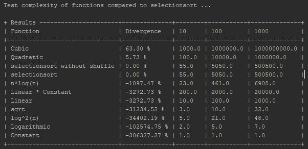

# Complexity Test
A simple tool to analyse the complexity of functions.

## How to use it?
See [example.py](example.py)

Instead of running on your local machine you can also test it in your Browser
[repl.it](https://repl.it/@w1nte/Complexity)

## Dependencies
* numpy
* terminaltables

## Environment
Python >= 3.6
